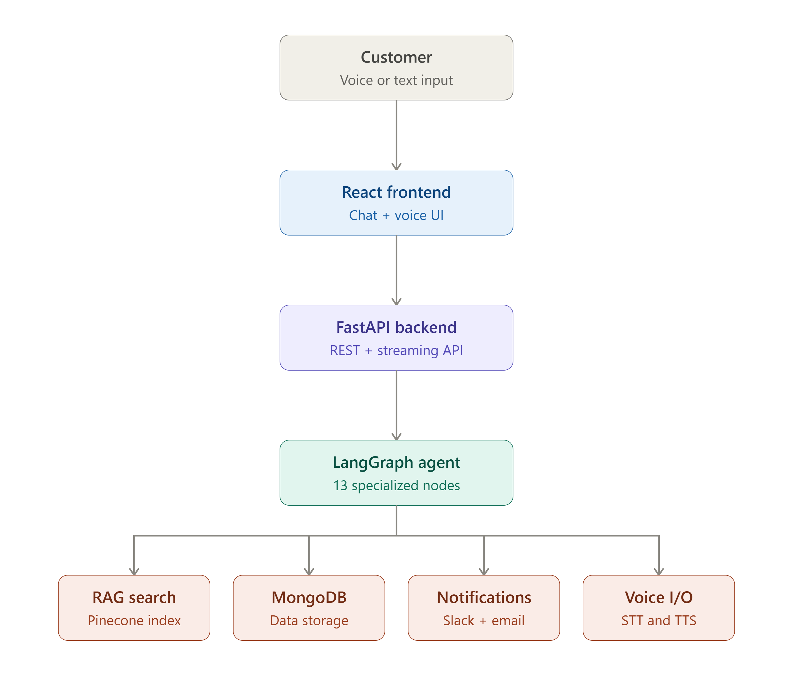
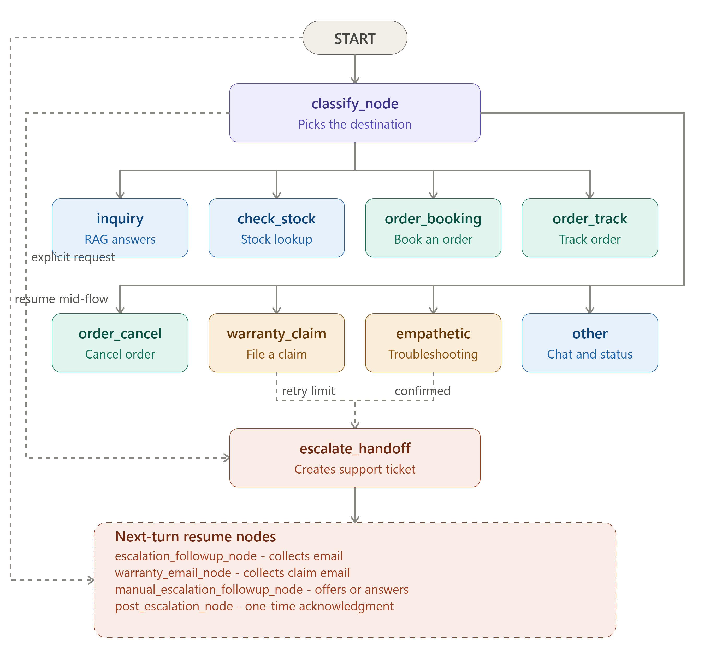
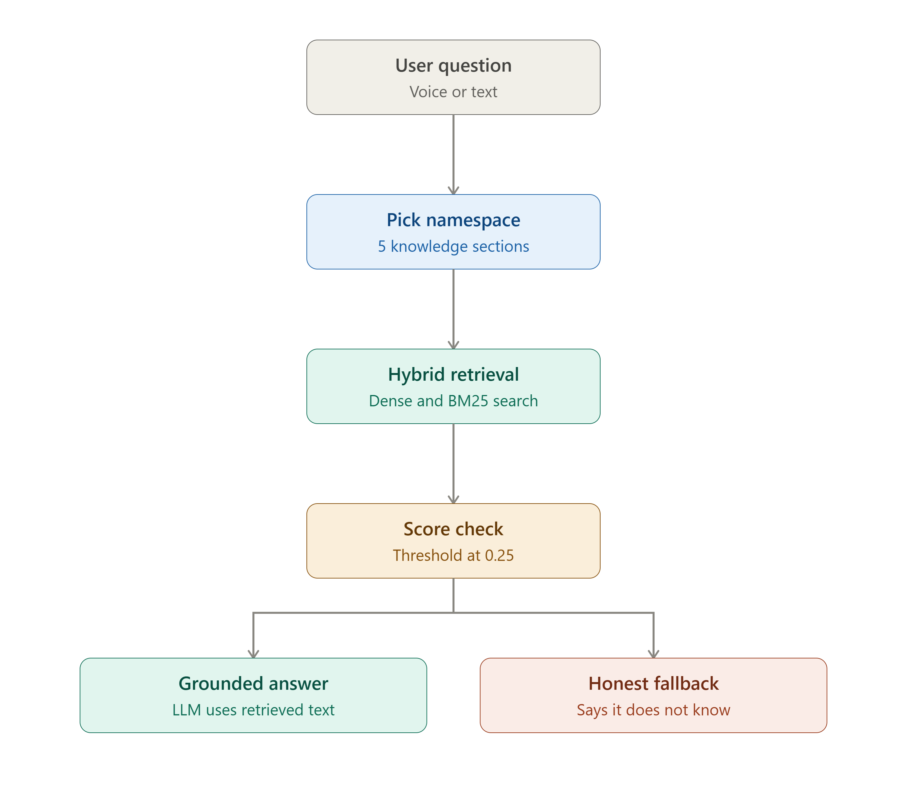
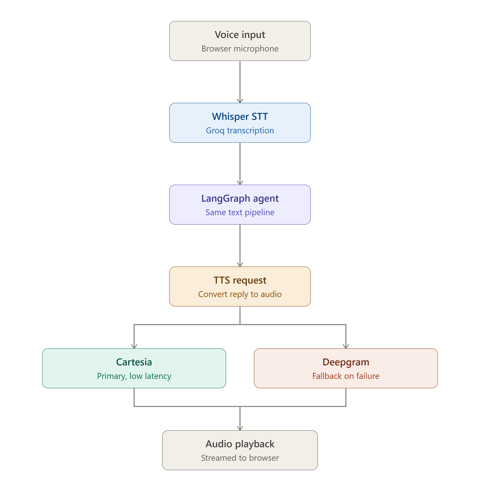
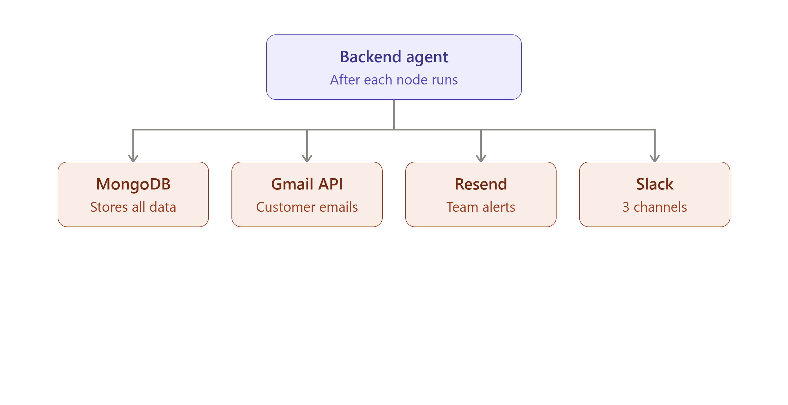

# VoiceCart

VoiceCart is a full-stack customer support agent for ShopNest Pulse, a fictional wireless earbuds brand. It handles product questions, stock checks, orders, warranty claims, troubleshooting, and escalation through either chat or voice.

The system combines LangGraph, hybrid-search RAG, MongoDB, Slack, email, and a React frontend into one production-style demo of an agentic support workflow with stateful routing, grounded answers, and deterministic tool use.

## Contents

- [Overview](#overview)
- [Diagrams](#diagrams)
- [Features](#features)
- [Tech Stack](#tech-stack)
- [Repository Layout](#repository-layout)
- [Local Setup](#local-setup)
- [API Endpoints](#api-endpoints)
- [Notes](#notes)
- [License](#license)

## Overview

VoiceCart is built around a FastAPI backend and a React frontend. User input arrives through the browser as text or voice, is classified by the LangGraph agent, and is then routed into the right support flow. The backend can retrieve product knowledge from Pinecone, read and write operational data in MongoDB, send notifications to Slack, and send support or customer emails.

## Diagrams

### High-Level Architecture

<p align="center">
      
</p>

This is the main end-to-end view of the product: frontend, backend, LangGraph, RAG, storage, notifications, and voice services.

### LangGraph Routing

<p align="center">
      
</p>

This shows how the agent moves between inquiry, stock, booking, tracking, cancel, warranty, complaint handling, escalation, and post-escalation follow-up.

### RAG Pipeline

<p align="center">
      
</p>

This is the retrieval path used for grounded answers: namespace selection, hybrid dense plus BM25 search, score thresholding, and the honest fallback when the answer is not in the KB.

### Voice Pipeline

<p align="center">
      
</p>

This shows the audio path: browser microphone, Groq Whisper transcription, the same LangGraph backend as text, Cartesia TTS, Deepgram fallback, and audio playback in the browser.

### Integrations Overview

<p align="center">
      
</p>

This diagram highlights how the backend agent talks to MongoDB, Gmail API, Resend, and Slack.

## Features

### Conversational Support

- Text chat and voice support in one flow.
- Streaming text responses over SSE for supported intents.
- Session state that persists in MongoDB through the `sessions` collection.
- One-turn and multi-turn interactions for orders, warranty claims, and escalation.

### Grounded Knowledge Base

- Hybrid retrieval with dense embeddings plus BM25 sparse search in Pinecone.
- Retrieval is limited to five namespaces: product-info, usage-guidance, troubleshooting, policies, and limitations.
- The assistant falls back to an honest "I do not know" style response when the KB does not support the answer.

### Order Handling

- Stock lookup before booking.
- Adaptive order collection across multiple turns.
- Inventory updates on booking and restoration on cancellation.
- Cash on Delivery messaging.
- Slack notifications for new orders and cancellations.
- Customer confirmation email support through Gmail API for allowlisted recipients.

### Warranty and Escalation

- Warranty claims only start when the user explicitly asks for a claim.
- Warranty flow collects the required fields and validates the ownership window.
- Escalation is triggered by repeated unresolved issues or explicit handoff requests.
- Support ticket summaries are generated for the team and sent to email plus Slack.
- After escalation, the next turn returns a one-time acknowledgment before normal chat resumes.

### Voice Experience

- Groq Whisper for transcription.
- Cartesia as the primary TTS provider.
- Deepgram as a timeout-bounded fallback when Cartesia fails.
- Graceful degradation when a provider is rate limited or unavailable.

## Tech Stack

| Layer | Technology |
| --- | --- |
| Frontend | React + Vite |
| Backend | FastAPI |
| Agent orchestration | LangGraph |
| LLMs | Groq Llama models |
| STT | Groq Whisper |
| TTS | Cartesia with Deepgram fallback |
| Embeddings | Cohere `embed-english-v3.0` |
| Retrieval | Pinecone hybrid search |
| Database | MongoDB Atlas |
| Email | Resend for support mail, Gmail API for customer confirmations |
| Notifications | Slack incoming webhooks |
| Observability | LangSmith |

## Repository Layout

```text
Customer-Support/
├── backend/
│   ├── main.py
│   ├── recreate_index.py
│   ├── requirements.txt
│   ├── .env.example
│   └── app/
│       ├── db.py
│       ├── email_service.py
│       ├── slack_service.py
│       ├── graph/
│       │   ├── graph.py
│       │   ├── nodes.py
│       │   └── voice_pipeline.py
│       ├── ingest/
│       │   ├── chunks.py
│       │   ├── upload.py
│       │   └── seed_inventory.py
│       └── retrieval/
│           └── retriever.py
├── frontend/
│   ├── package.json
│   └── src/
│       ├── App.jsx
│       └── components/
└── pipelines/
      ├── high_level_architecture.png
      ├── integrations_overview.png
      ├── langgraph_full_connections.png
      ├── rag_pipeline.png
      └── voice_pipeline.png
```

## Local Setup

### 1. Prerequisites

- Python 3.11 or newer.
- Node.js 20 or newer.
- MongoDB Atlas database.
- Pinecone index.
- API keys for Groq, Cohere, Cartesia, Deepgram, Resend, Slack, and LangSmith.
- Optional: Gmail API OAuth token if you want customer order confirmations to go to real inboxes.

### 2. Clone the repo

```powershell
git clone https://github.com/JamshedAli18/Customer-Support-Agent.git
cd Customer-Support-Agent
```

### 3. Configure the backend environment

Copy `backend/.env.example` to `backend/.env` and fill in the values.

Required variables used by the current code:

```env
GROQ_API_KEY=
CARTESIA_API_KEY=
DEEPGRAM_API_KEY=
COHERE_API_KEY=
PINECONE_API_KEY=
PINECONE_INDEX_NAME=voicecart-kb
MONGODB_URI=
MONGODB_DB_NAME=voicecart
RESEND_API_KEY=
SUPPORT_EMAIL_TO=
SLACK_WEBHOOK_ORDERS=
SLACK_WEBHOOK_TICKETS=
SLACK_WEBHOOK_WARRANTY=
LANGSMITH_API_KEY=
LANGSMITH_TRACING=true
LANGSMITH_PROJECT=voicecart
ALLOWED_EMAIL_RECIPIENTS=your_test_email@gmail.com,another_test_email@gmail.com
```

Notes:

- The code persists sessions in MongoDB, so `MONGODB_URI` is required.
- `ALLOWED_EMAIL_RECIPIENTS` controls which addresses can receive real customer confirmation emails.
- Gmail API credentials are read from `backend/app/token.json` locally, or `/etc/secrets/token.json` in deployment.

### 4. Set up the backend

```powershell
cd backend
python -m venv .venv
.venv\Scripts\Activate.ps1
pip install -r requirements.txt
```

If PowerShell blocks script activation, run this once in the same terminal session:

```powershell
Set-ExecutionPolicy -Scope Process RemoteSigned
```

### 5. Prepare data and the Pinecone index

Run these from the `backend` folder after the environment is configured:

```powershell
python app/ingest/seed_inventory.py
python recreate_index.py
python app/ingest/upload.py
```

What each step does:

- `seed_inventory.py` populates MongoDB inventory documents.
- `recreate_index.py` creates the Pinecone index with the correct hybrid-search settings.
- `upload.py` chunks the knowledge base, creates embeddings, fits BM25, and uploads the vectors to Pinecone.

### 6. Run the backend API

```powershell
uvicorn main:app --reload --port 8000
```

Backend API is then available at `http://127.0.0.1:8000`.

### 7. Set up the frontend

Open a second terminal:

```powershell
cd frontend
npm install
npm run dev
```

Vite will print the local frontend URL, usually `http://localhost:5173`.
      ├── high_level_architecture.png
      ├── integrations_overview.png
      ├── langgraph_full_connections.png
      ├── rag_pipeline.png
      └── voice_pipeline.png
3. Try a voice turn if your browser allows microphone access.
4. Check that the backend health endpoint returns OK at `/api/health`.

## API Endpoints

| Method | Endpoint | Purpose |
| --- | --- | --- |
| GET | `/api/health` | Health check |
| POST | `/api/text/stream` | Streaming text chat over SSE |
| POST | `/api/voice` | Voice or text turn that returns JSON plus base64 audio |
| DELETE | `/api/session/{session_id}` | Reset a session |

## Notes

- The assistant is designed to stay grounded in retrieved knowledge and to say when it does not know something.
- Order confirmations are sent only to allowlisted email addresses.
- The voice pipeline falls back from Cartesia to Deepgram if the primary provider fails.
- MongoDB stores operational data such as inventory, orders, tickets, warranty claims, and sessions.

## License

This project is for personal, portfolio, and learning use.